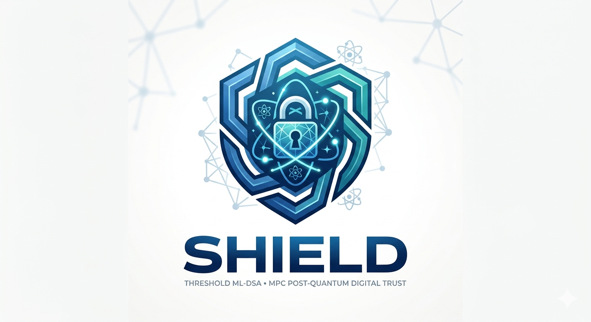

<h1 align="center">SHIELD - Post-Quantum Threshold Signatures</h1>

<p align="center">
  <strong>NIST FIPS-204 Compliant Threshold ML-DSA (Dilithium) Implementation for Federal PKI</strong>
</p>

<p align="center">
  <a href="#-features">Features</a> •
  <a href="#-quick-start">Quick Start</a> •
  <a href="#-research--academic-use">Research</a> •
  <a href="#-citation">Citation</a>
</p>

---

## Overview

**SHIELD** (Secure NIST-compliant tHreshold post-quantum sIgnaturE for federaL PKI Digital-trust) is a cutting-edge implementation of **threshold ML-DSA digital signatures**, fully compliant with **NIST FIPS-204** post-quantum cryptography standards. 

Built using **secure multi-party computation (MPC)** techniques, SHIELD enables distributed key generation and signing operations, providing quantum-resistant security for critical infrastructure including **Federal Public Key Infrastructure (PKI)**, enterprise certificate authorities, and distributed trust systems.

### What is Threshold ML-DSA?

ML-DSA (Module-Lattice-Based Digital Signature Algorithm), formerly known as **Dilithium**, is one of NIST's standardized post-quantum cryptographic algorithms. SHIELD extends ML-DSA to support **threshold signatures**, where:

- 🔐 **Private keys are distributed** across multiple parties
- 🤝 **Signatures require cooperation** between parties (no single point of failure)
- 🛡️ **Quantum-resistant security** compliant with NIST FIPS-204
- 🏛️ **Federal PKI ready** for government and enterprise deployment

### Why SHIELD?

As quantum computers threaten traditional cryptographic systems (RSA, ECDSA), organizations must transition to **post-quantum cryptography (PQC)**. SHIELD provides:

- ✅ **NIST-approved security**: Full FIPS-204 compliance
- ✅ **Distributed trust**: Threshold architecture eliminates single points of compromise
- ✅ **Production-oriented**: Built with EMP-toolkit for real-world deployment
- ✅ **Flexible configuration**: Support for 2-5 parties and multiple security levels
- ✅ **Open source**: MIT licensed for commercial and research use

> ⚠️ **Current Status: Proof of Concept**  
> This is a research prototype demonstrating threshold ML-DSA feasibility. The current implementation processes operations individually for clarity. Production optimization (batched polynomial operations) will significantly reduce communication overhead and round complexity (considered in the paper as well and will be uploaded soon).

---

## 🚀 Features

### Core Capabilities

- ✅ **Threshold ML-DSA (Dilithium)**: Distributed key generation and signing
- ✅ **FIPS-204 Compliance**: Follows NIST post-quantum cryptography standards
- ✅ **Configurable MPC**: 2-5 parties with customizable security parameters
- ✅ **Hybrid MPC Protocols**: SPDZ for arithmetic + WRK17 for Boolean circuits
- ✅ **Circuit-based Computation**: Bristol-format circuit support

### Performance & Optimization

- ✅ **GMP-backed Arithmetic**: Large-number support for cryptographic operations
- ✅ **SIMD Optimization**: SSE4.1, AVX, AVX2, and AES acceleration
- ✅ **Flexible Numeric Types**: Configurable underlying types (int64_t, GMP, etc.)
- ✅ **Modular Testing**: GoogleTest framework for reliability

### Security Levels

Supports all NIST ML-DSA security levels:
- **Level 2** (equivalent to AES-128)
- **Level 3** (equivalent to AES-192)
- **Level 5** (equivalent to AES-256)

---

## 📦 Requirements

### System Requirements

- **Operating System**: Ubuntu 24.04 LTS (tested)
- **Compiler**: GCC 13+ or Clang 16+ (C++20 support required)
- **CMake**: Version 3.26 or higher
- **Memory**: 4GB RAM minimum (8GB+ recommended)
- **Storage**: 500MB for source + dependencies

### Dependencies

Install system packages via `apt`:

```bash
sudo apt-get install -y \
  cmake \
  g++ \
  libssl-dev \
  libgtest-dev \
  libgmp-dev
```

**Package details:**

| Package | Purpose | Version |
|---|---|---|
| `cmake` | Build system | ≥ 3.26 |
| `g++` | C++20 compiler | GCC 13+ / Clang 16+ |
| `libssl-dev` | OpenSSL cryptographic primitives | Latest |
| `libgtest-dev` | GoogleTest unit testing framework | Latest |
| `libgmp-dev` | GNU Multiple Precision arithmetic | Latest |

> **Note:** `libgmpxx` (C++ bindings) is typically included with `libgmp-dev`. If missing, install `libgmpxx4ldbl` separately.

---

### EMP-toolkit Installation

SHIELD requires **EMP-toolkit** libraries for secure multi-party computation. Build and install from source:

#### 1. Install emp-tool (Core MPC Framework)

```bash
git clone https://github.com/emp-toolkit/emp-tool.git
cd emp-tool
mkdir build && cd build
cmake .. -DCMAKE_INSTALL_PREFIX=/usr/local
make -j$(nproc)
sudo make install
cd ../..
```

#### 2. Install emp-ot (Oblivious Transfer Protocols)

```bash
git clone https://github.com/emp-toolkit/emp-ot.git
cd emp-ot
mkdir build && cd build
cmake .. -DCMAKE_INSTALL_PREFIX=/usr/local
make -j$(nproc)
sudo make install
cd ../..
```

> ⚠️ **Important**: Install `emp-tool` before `emp-ot` due to dependency requirements.

---

## 🚀 Quick Start

### Installation

```bash
# Clone the repository
git clone https://github.com/open-threshold-pqc/SHIELD.git
cd SHIELD

# Create build directory
mkdir build && cd build

# Configure build (2 parties, security level 2)
cmake --fresh .. \
  -DQST_NUM_OF_MPC_PARTIES=2 \
  -DQST_ML_DSA_MODE=2

# Build the threshold ML-DSA test
make -j$(nproc) test_threshold_ml_dsa

# Run the test suite
./out/test/test_threshold_ml_dsa
```

### Configuration Options

Customize your build with CMake options:

| Option | Default | Values | Description |
|---|---|---|---|
| `QST_NUM_OF_MPC_PARTIES` | `2` | `2-5` | Number of MPC parties for threshold signing |
| `QST_ML_DSA_MODE` | `2` | `2`, `3`, `5` | NIST ML-DSA security level (AES-128/192/256 equivalent) |
| `QST_UNDERLYING_NUMERIC_TYPE` | `int64_t` | `int32_t`, `int64_t` | Numeric type for MPC operations |

### Example Configurations

**High Security (5 parties, Level 5)**
```bash
cmake .. \
  -DQST_NUM_OF_MPC_PARTIES=5 \
  -DQST_ML_DSA_MODE=5
```

**Balanced (3 parties, Level 3)**
```bash
cmake .. \
  -DQST_NUM_OF_MPC_PARTIES=3 \
  -DQST_ML_DSA_MODE=3
```

> **Note**: After changing configuration options, re-run both `cmake` and `make` commands.

### Expected Output

A successful test run displays:

```
[Threshold Dilithium Test]
 - Parties      : 2
 - Mode         : 2
Preprocessing 5121 UNSIGNED_ADD_MOD_8380417_23_23_23 Circuits ....
...
[Dilithium Parameter Summary]
  CRYPTO_PUBLICKEYBYTES  = 1312
  CRYPTO_SECRETKEYBYTES  = 2560
  CRYPTO_BYTES           = 2420

Threshold Dilithium test passed successfully!
```

> **Performance Note**: The preprocessing phase evaluates Bristol-format arithmetic circuits and may require 2-5 minutes depending on hardware specifications.

---

## 📚 Documentation

### Project Structure

```
SHIELD/
├── src/
│   ├── include/
│   │   └── ml_dsa/
│   │       └── threshold/    # Threshold-specific implementations
│   └── ...
├── test/                     # Unit tests and integration tests
├── data/                     # Circuit definitions and test vectors
└── CMakeLists.txt           # Build configuration
```

### Implementation Details

SHIELD follows the **FIPS-204 specification** structure with threshold extensions:

- **Core Functions**: Threshold key generation, distributed signing, standard verification
- **Threshold Operations**: All files prefixed with `threshold_*` in [`src/include/ml_dsa/threshold/`](src/include/ml_dsa/threshold/)
- **MPC Protocols**: SPDZ for modular arithmetic, WRK17 for Boolean operations
- **Circuit Definitions**: Bristol-format circuits for secure computation

### Bristol Circuit Generation

Guidelines for generating Bristol circuits are provided in the companion project:  
**[SyntoYoCirc](https://github.com/open-threshold-pqc/syntyocirc)** - Tools and documentation for creating custom Bristol-format circuits

---

## 🔬 Research & Academic Use

### Publications

SHIELD is based on peer-reviewed research to be presented at **IEEE Symposium on Security and Privacy 2026**:

```bibtex
@inproceedings{sedghi2026shield,
  title     = {A Full Threshold NIST PQC-Compliant Framework for Distributed Trust in Federal Public Key Infrastructure},
  author    = {Sedghighadikolaei, Kiarash and Sun, Changqi and Hoang, Thang and Hamdaoui, Bechir and Yavuz, Attila A.},
  booktitle = {Proceedings of the IEEE Symposium on Security and Privacy (SP)},
  year      = {2026}
}
```

### Related Work

SHIELD builds upon:
- **NIST FIPS-204**: ML-DSA (Dilithium) standardization
- **SPDZ Protocol**: Secure multi-party computation framework
- **WRK17**: Efficient Boolean circuit evaluation
- **EMP-toolkit**: High-performance MPC implementation

### Academic Collaboration

We welcome research collaborations on threshold post-quantum cryptography, protocol optimization, security analysis, and performance benchmarking.

---

## 🔗 Related Projects

### Post-Quantum Cryptography

- [NIST PQC Project](https://csrc.nist.gov/projects/post-quantum-cryptography) - Official NIST standardization effort
- [liboqs](https://github.com/open-quantum-safe/liboqs) - Open Quantum Safe cryptographic library
- [PQClean](https://github.com/PQClean/PQClean) - Clean PQC implementations

### Threshold Cryptography

- [threshold-ed25519](https://github.com/celo-org/celo-threshold-bls-rs) - Threshold signatures for classical curves
- [tss-lib](https://github.com/bnb-chain/tss-lib) - Threshold signature scheme library
- [Multi-Party-ECDSA](https://github.com/ZenGo-X/multi-party-ecdsa) - Threshold ECDSA implementation

### MPC Frameworks

- [EMP-toolkit](https://github.com/emp-toolkit) - Efficient Multi-Party computation toolkit
- [MP-SPDZ](https://github.com/data61/MP-SPDZ) - Versatile MPC framework
- [SCALE-MAMBA](https://github.com/KULeuven-COSIC/SCALE-MAMBA) - Secure Computation Algorithms from LEuven

---

## 🌐 Community & Support

### Get Help

- **GitHub Issues**: [Report bugs or request features](https://github.com/open-threshold-pqc/SHIELD/issues)
- **GitHub Discussions**: [Ask questions and share ideas](https://github.com/open-threshold-pqc/SHIELD/discussions)
- **Email**: Contact the research team (see paper authors)

### Stay Updated

- ⭐ **Star this repository** to receive updates
- 👀 **Watch releases** for new versions
- 📧 **Follow** our research group for announcements

---


## 🔍 Keywords for Researchers

`post-quantum cryptography` `PQC` `NIST FIPS-204` `ML-DSA` `Dilithium` `threshold signatures` `threshold cryptography` `secure multi-party computation` `MPC` `SPDZ` `distributed PKI` `federal PKI` `quantum-resistant` `lattice-based cryptography` `digital signatures` `distributed trust` `cryptographic protocols` `EMP-toolkit` `Bristol circuits` `post-quantum security` `quantum computing` `cryptanalysis` `secure computation` `threshold schemes` `Byzantine fault tolerance`

---

<p align="center">
  <a href="#overview">Back to Top ↑</a>
</p>
